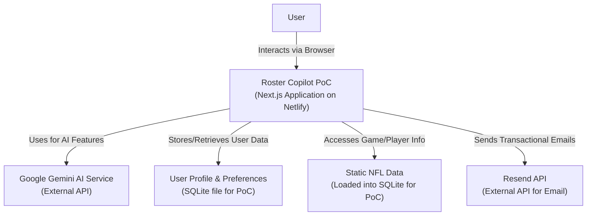
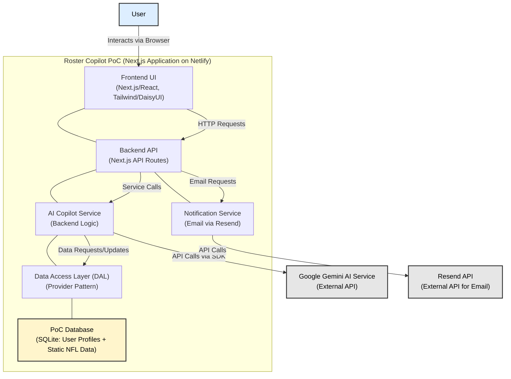
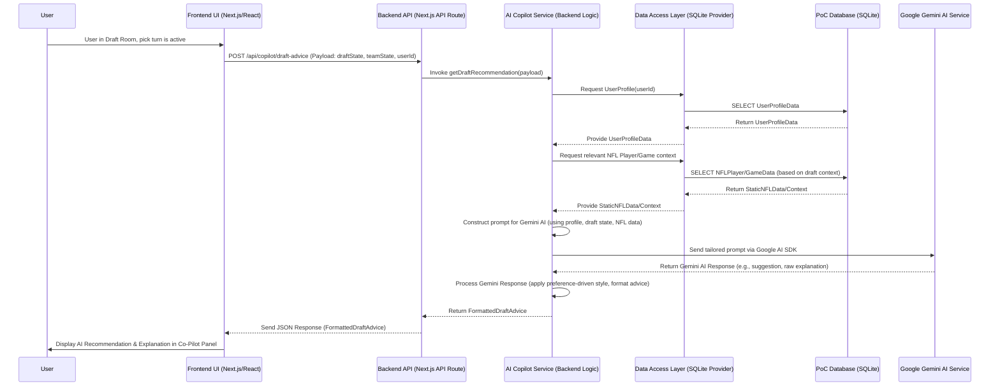
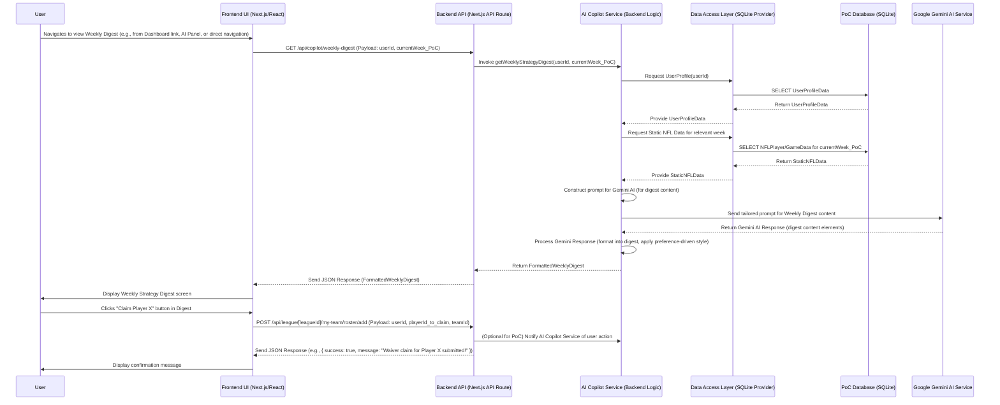

# Roster Copilot Architecture Document (Proof-of-Concept)

## Introduction / Preamble

This document outlines the overall project architecture for the **Roster Copilot Proof-of-Concept (PoC)**, including backend systems, frontend structure, key components, technology choices, and architectural patterns. Its primary goal is to serve as the guiding architectural blueprint for AI-driven development for a one-month hackathon, ensuring consistency and adherence to chosen patterns and technologies.
**Relationship to Frontend Architecture:** As this project includes a significant user interface, a more detailed Frontend Architecture Document would typically be created (potentially by a Design Architect using the prompt at the end of this document) to elaborate on frontend-specific design and must be used in conjunction with this overall system architecture. Core technology stack choices documented herein (see "Definitive Tech Stack Selections") are definitive for the entire project.

## Table of Contents
* Technical Summary
* High-Level Overview
* Architectural / Design Patterns Adopted
* Component View
* Project Structure
* API Reference
* Data Models
* Core Workflow / Sequence Diagrams
* Definitive Tech Stack Selections
* Infrastructure and Deployment Overview
* Error Handling Strategy
* Coding Standards
* Overall Testing Strategy
* Security Best Practices
* Key Reference Documents
* Change Log
* Prompt for Design Architect (Frontend Architecture Mode)

## Technical Summary

Roster Copilot, for its Proof-of-Concept (PoC) stage, will be developed as a web-based application utilizing a full-stack Next.js framework (TypeScript, Node.js) to ensure rapid development for a one-month hackathon. The core innovation is its AI Copilot, powered by Google Gemini AI, which will provide personalized user onboarding (via archetypes and a learning profile), "Draft Day Co-Pilot" assistance, and "In-Season Strategic Guidance" (through a weekly digest and critical alerts), all with preference-driven explanations. The frontend will be built with React (via Next.js) and styled using Tailwind CSS with DaisyUI to achieve a modern, clean, and responsive user interface that "pops," particularly for new fantasy football players. For the PoC, all NFL-related data (player stats, scores, news) will be static/synthetic, accessed via a provider model designed for future live data integration, with basic persistence for user profiles managed by a local SQLite database. Emails (verification, password reset) will be handled via Resend. The application will be deployed on Netlify. The architecture prioritizes demonstrating the AI Copilot's unique value and ease of use, aligning with the primary goal of making fantasy football more accessible and strategically rewarding.

## High-Level Overview

Roster Copilot, for its Proof-of-Concept (PoC) deployment, will be architected as an **Integrated Full-Stack Web Application** utilizing the Next.js framework. Next.js will serve both the frontend user interface (React components) and the backend API routes (as serverless functions when deployed on Netlify). This approach prioritizes development speed and a unified codebase for the hackathon.

The application will reside in a **single Git repository**, simplifying version control and deployment for the PoC.

The primary user interaction and data flow is conceptualized as follows:
1.  A **User** interacts with the Roster Copilot frontend via a web browser.
2.  User actions (e.g., onboarding choices, draft picks, requests for advice) are sent to **Next.js API Routes**.
3.  These API routes handle business logic, interact with a local **SQLite database** (for User Profile data persistence in the PoC), access **Static NFL Data files** (for game/player information, which will also be loaded into SQLite), make calls to the external **Google Gemini AI Service** for generating personalized insights and explanations, and interact with **Resend** for transactional emails.
4.  The API routes then return processed information or AI-generated advice to the Next.js frontend, which presents it to the user through the AI Copilot interface elements (panel, digest, alerts).

Below is a simplified System Context diagram illustrating these interactions:



## Architectural / Design Patterns Adopted

1.  **Integrated Full-Stack Application (via Next.js):** Utilizing Next.js to handle both frontend (React components) and backend (API routes) within a single, cohesive project structure. *Rationale:* Simplifies development, deployment (Netlify), and tooling for the PoC; leverages user familiarity.
2.  **Provider Model / Repository Pattern (for Data Access):** Abstracting data access logic for SQLite (both User Profile and Static NFL Data for PoC). *Rationale:* Supports NFR for Maintainability/Extensibility, making future swaps to live databases/APIs much simpler with minimal changes to core application logic.
3.  **API-Driven AI Integration (for Google Gemini AI):** All interactions with Google Gemini AI are encapsulated and managed through dedicated backend services/API routes. *Rationale:* Centralizes AI interaction logic, manages API key security, allows prompt optimization, and keeps the frontend focused on presentation.
4.  **Component-Based Architecture (for Frontend - via React/Next.js):** The UI will be built as a collection of reusable React components, styled with Tailwind CSS and DaisyUI. *Rationale:* Standard for modern web development with React; promotes UI reusability, maintainability, testability, and aligns with chosen UI libraries.
5.  **Serverless Functions (for API Backend - via Netlify/Next.js):** Next.js API routes will be deployed as serverless functions on Netlify. *Rationale:* Scalable, cost-effective for PoC, simplifies backend infrastructure management; Next.js handles the abstraction.
6.  **External Email Service Integration (Resend):** Transactional emails (e.g., verification, password reset) are handled via Resend. *Rationale:* Reliable email delivery without managing email server infrastructure; common practice for web applications.

## Component View

The Roster Copilot PoC comprises the following key logical components:

1.  **Frontend UI (Next.js/React)**
    * **Description & Responsibilities:** Renders the user interface (UI/UX Specification), handles user input, manages client-side state (React Context/hooks or Zustand), communicates with the Backend API, displays information including AI Copilot insights, and implements the persistent "AI Copilot Panel/Icon." Built with React, Tailwind CSS, and DaisyUI.
    * **Key Interactions:** User (direct interaction), Backend API (HTTP requests/responses), Client-Side State Management.

2.  **Backend API (Next.js API Routes)**
    * **Description & Responsibilities:** Exposes HTTP endpoints for the Frontend UI, handles requests, orchestrates calls to the "AI Copilot Service," "Data Access Layer (DAL)," and "Notification Service (for email)," manages basic user sessions, formats responses. Deployed as serverless functions on Netlify.
    * **Key Interactions:** Frontend UI (receives requests, sends responses), AI Copilot Service (invokes for AI logic), Data Access Layer (DAL) (for data operations), Notification Service (for sending emails).

3.  **AI Copilot Service (Backend Logic within Next.js)**
    * **Description & Responsibilities:** Central "brain" for AI features. Processes requests for AI insights, manages/interprets User Preference Profile (via DAL), accesses Static NFL Data (via DAL), constructs prompts for and communicates with Google Gemini AI Service (via SDK), processes Gemini responses (applying preference-driven explanation style), and supports "Learn-As-You-Go" mechanism.
    * **Key Interactions:** Backend API (receives requests, returns advice/content), Data Access Layer (DAL) (for User Profile & Static NFL Data), Google Gemini AI Service (External) (sends prompts, receives responses).

4.  **Data Access Layer (DAL) (Backend Logic within Next.js - Revised)**
    * **Description & Responsibilities:** Implements the "Provider Model / Repository Pattern" abstracting SQLite-specific logic. Provides a stable interface for CRUD operations on User Profile & Preferences data and for reading/querying Static NFL Data (both stored in the PoC SQLite database). Internally executes direct SQL queries via a lightweight Node.js SQLite library. Manages SQLite connection and initial data seeding for PoC.
    * **Key Interactions:** AI Copilot Service & Backend API (primary consumers, via abstract interface functions), SQLite Database (executes SQL queries).

5.  **Notification Service (Backend Logic within Next.js - for Email)**
    * **Description & Responsibilities:** Handles sending transactional emails (e.g., account verification, password reset) via the Resend API. Encapsulates email formatting and interaction with Resend.
    * **Key Interactions:** Backend API (receives requests to send emails), Resend API (External) (sends email delivery requests).

6.  **Google Gemini AI Service (External)**
    * **Description & Responsibilities:** External third-party service by Google. Receives prompts from Roster Copilot's "AI Copilot Service" (via Google AI SDK) and returns generative AI responses for advice, explanations, and insights. Appropriate Gemini models (e.g., Flash, Pro) will be selected for PoC needs.
    * **Key Interactions:** AI Copilot Service (sends prompts, receives responses), Internet (for backend to reach Google APIs).

7.  **Resend API (External)**
    * **Description & Responsibilities:** External third-party service for sending transactional emails. Receives requests from Roster Copilot's "Notification Service."
    * **Key Interactions:** Notification Service (sends email requests).

**Component Interaction Diagram (PoC):**


## Project Structure

```plaintext
roster-copilot/
├── .env.local                  # Local environment variables (e.g., Gemini API Key, Resend API Key - NOT committed to Git)
├── .gitignore                  # Specifies intentionally untracked files for Git
├── .next/                      # Next.js build output (automatically generated, git-ignored)
├── app/                        # Next.js App Router: Core application (pages, layouts, API routes)
│   ├── (auth)/                 # Optional route group for authentication pages
│   │   ├── login/page.tsx      # Login screen
│   │   └── signup/page.tsx     # Sign-up screen
│   ├── (main)/                 # Route group for main application sections (after login)
│   │   ├── layout.tsx          # Main app layout (e.g., with sidebar, AI Copilot panel)
│   │   ├── dashboard/page.tsx  # League Home / Main Dashboard screen
│   │   ├── draft/[leagueId]/page.tsx # Live Draft Room screen
│   │   ├── league/[leagueId]/  # Screens related to a specific league
│   │   │   ├── roster/page.tsx   # User's team roster
│   │   │   ├── lineup/page.tsx   # Set weekly lineup
│   │   │   ├── waivers/page.tsx  # Waiver wire / Add-drop players
│   │   │   └── standings/page.tsx# League standings
│   │   ├── copilot/             # Screens specifically for AI Copilot interactions
│   │   │   ├── digest/page.tsx # Weekly Strategy Digest screen
│   │   │   └── profile/page.tsx# User Profile / AI Copilot preferences view
│   │   └── onboarding/page.tsx # Simple host page for the AI Copilot panel's conversational onboarding flow; may include a visual progress timeline.
│   ├── api/                    # Backend API routes (Next.js Route Handlers)
│   │   ├── auth/               # Authentication related API routes
│   │   │   ├── signup/route.ts
│   │   │   ├── login/route.ts
│   │   │   ├── logout/route.ts
│   │   │   ├── verify-email/[token]/route.ts # Example for email verification
│   │   │   ├── forgot-password/route.ts
│   │   │   └── reset-password/route.ts
│   │   ├── copilot/             # API routes for AI Copilot features
│   │   │   ├── onboarding-profile/route.ts
│   │   │   ├── draft-advice/route.ts
│   │   │   ├── weekly-digest/route.ts
│   │   │   └── (other_copilot_apis...)/route.ts
│   │   └── (other_general_api_routes...)/route.ts
│   ├── globals.css             # Global styles, Tailwind base/directives
│   ├── layout.tsx              # Root layout for the entire application
│   └── page.tsx                # Homepage / Initial landing page
├── components/                 # Shared React UI components
│   ├── ai-copilot/              # Components for the AI Copilot panel/overlay (including interactive chat elements like Archetype Cards)
│   │   └── AIPanel.tsx
│   ├── core/                   # Basic, reusable UI elements
│   ├── draft/                  # Components for the Draft Room UI
│   ├── layout/                 # Structural layout components
│   └── onboarding/             # UI components specific to the onboarding page, like the progress timeline
├── data/                       # For PoC: Static data files and database
│   ├── static-nfl-data/        # Directory for JSON files (player info, schedules, etc. - to be loaded into SQLite for PoC)
│   │   ├── nfl-players.json
│   │   └── nfl-games.json
│   └── roster_copilot_poc.db    # SQLite database file
├── lib/                        # Shared utilities, constants, core backend logic
│   ├── ai/                     # AI Copilot Service logic: prompt engineering, interaction with Gemini SDK, response processing
│   ├── dal/                    # Data Access Layer: SQLite interaction logic (using Provider Model), static data parsing functions
│   ├── services/               # Other backend services (e.g., NotificationService for email)
│   │   └── NotificationService.ts
│   └── utils/                  # General utility functions
├── public/                     # Static assets accessible from the web root (images, fonts, manifest.json, etc.)
├── scripts/                    # Utility scripts
│   └── database/
│       └── seed-db.ts          # Example script for seeding database
├── next.config.js              # Next.js configuration file
├── package.json                # Project dependencies (npm/yarn) and scripts
├── tailwind.config.ts          # Tailwind CSS configuration file
├── tsconfig.json               # TypeScript configuration file
└── README.md                   # Project overview, setup, and development instructions
```
**Key Directory Descriptions:**
* **`app/`**: Core Next.js application using App Router (UI pages, layouts, API routes). `app/onboarding/page.tsx` serves as a host for the panel-driven conversational onboarding.
* **`components/`**: Reusable React UI components, including those for the AI Copilot panel (`ai-copilot/`) and onboarding UI elements (`onboarding/`).
* **`data/`**: Contains static JSON data (to be loaded into SQLite) and the SQLite database file for the PoC.
* **`lib/`**: Houses shared backend logic: `lib/ai/` for AI Copilot Service, `lib/dal/` for Data Access Layer, `lib/services/` for other services like NotificationService.
* **`public/`**: For static assets like images.
* **`scripts/`**: For utility/developer scripts like database seeding.

## API Reference

### External APIs Consumed

**#### Google Gemini AI Service API**

* **Purpose:** To provide the core generative AI capabilities for the Roster Copilot's intelligent features.
* **Base URL(s):** N/A (interaction via official Google AI SDK for Node.js/TypeScript).
* **Authentication:** API Key (managed as a secure backend environment variable `GEMINI_API_KEY`).
* **Key SDK Interactions (Conceptual for PoC):**
    * **Onboarding Profile Analysis/Greeting Generation:** Gemini model invoked with user archetype/preferences for personalized onboarding elements.
    * **Draft Pick Recommendation & Explanation:** Gemini model invoked with draft state, user profile, and player data for personalized draft advice.
    * **In-Season Advice Generation (Weekly Digest, Alerts, On-Demand Queries):** Gemini model invoked with user profile, weekly static NFL data, and specific advice type needed.

**#### Resend API**

* **Purpose:** To send transactional emails for user account actions (e.g., email verification, password reset).
* **Base URL(s):** (Refer to Resend official documentation - e.g., `https://api.resend.com`)
* **Authentication:** API Key (Header Name: `Authorization: Bearer YOUR_RESEND_API_KEY`). Key stored in environment variable `RESEND_API_KEY`.
* **Key Endpoints Used (Conceptual):**
    * **`POST /emails`**:
        * Description: Sends an email.
        * Request Body Schema: (JSON including `from`, `to`, `subject`, `html` content, etc. as per Resend API docs).
* **Link to Official Docs:** `https://resend.com/docs`

### Internal APIs Provided (If Applicable)

**#### Roster Copilot Internal API (Next.js API Routes)**

* **Purpose:** To provide the Frontend UI with necessary data, process user actions, and serve AI-driven insights from the AI Copilot Service.
* **Base URL(s):** `/api/...`
* **Authentication/Authorization:** Basic session management for PoC; protected routes for user-specific data.
* **Key Endpoints (Conceptual for PoC):**
    * **Authentication (`/api/auth/`):** `signup` (POST), `login` (POST), `logout` (POST), `session` (GET), `verify-email/[token]` (GET), `forgot-password` (POST), `reset-password` (POST).
    * **User Profile (`/api/users/me`):** `GET` (fetch profile), `PUT` (update profile - including archetype, onboarding answers).
    * **AI Copilot - Onboarding & Profile (`/api/copilot/`):** `onboarding-profile` (POST/GET - potentially covered by general user profile update), `update-preference` (POST).
    * **AI Copilot - Draft Assistance (`/api/copilot/`):** `draft-advice` (POST with draft state, returns advice).
    * **AI Copilot - In-Season Guidance (`/api/copilot/`):** `weekly-digest` (GET), `critical-alert-check` (GET), `on-demand-query` (POST).
    * **Core Fantasy League Data (`/api/league/`, `/api/team/` - simplified for PoC):** `leagues` (POST for create, GET for list user is in), `leagues/{leagueId}/details` (GET), `leagues/{leagueId}/join` (POST), `leagues/{leagueId}/my-team/roster` (GET), `leagues/{leagueId}/my-team/lineup` (POST), `leagues/{leagueId}/available-players` (GET), `leagues/{leagueId}/my-team/roster/add` (POST), `leagues/{leagueId}/my-team/roster/drop` (POST), `leagues/{leagueId}/scores` (GET), `leagues/{leagueId}/standings` (GET), `leagues/{leagueId}/schedule` (GET).
    * **Players (`/api/players/`):** `players/{playerId}` (GET), `players?search=...` (GET).


## Data Models

### Core Application Entities / Domain Objects

**#### UserProfile**
* **Description:** Represents a Roster Copilot user and stores their preferences for personalizing the AI Copilot experience. Persisted in SQLite for PoC.
* **Schema / Interface Definition (PoC Scope):**
    ```typescript
    interface UserProfile {
      userId: string; 
      username: string;
      email: string; // Added for login and notifications
      passwordHash: string; // For storing hashed password
      emailVerified: boolean; // Added for email verification status
      selectedArchetype: "Eager Learner" | "Calculated Strategist" | "Bold Playmaker" | "Busy Optimizer" | null; // Updated
      onboardingAnswers?: {
        preferredExplanationDepth?: "simple" | "standard" | "detailed";
        riskComfortLevel?: "low" | "medium" | "high";
      };
      riskToleranceNumeric?: number; 
      aiInteractionStyle?: "concise" | "balanced" | "thorough"; 
      favoriteNFLTeam?: string;
      teamsToAvoidPlayersFrom?: string[];
      learnedObservations?: {
        draftTendencies?: string[]; 
        playerStyleAffinity?: string[]; 
      };
      createdAt: string; 
      updatedAt: string; 
    }
    ```

**#### NFLPlayer (Static PoC Data)**
* **Description:** Represents an NFL player with essential information and PoC-specific data (e.g., projected points for a demo week). Pre-loaded into SQLite from static sources.
* **Schema / Interface Definition (PoC Scope):**
    ```typescript
    interface NFLPlayer {
      playerId: string; 
      fullName: string; 
      position: "QB" | "RB" | "WR" | "TE" | "K" | "DEF"; 
      nflTeamAbbreviation: string; 
      status?: "Active" | "Injured_Out" | "Injured_Questionable" | "Bye Week"; 
      projectedPoints?: number; 
      keyAttributes?: {
        consistencyRating?: "High" | "Medium" | "Low";
        upsidePotential?: "High" | "Medium" | "Low";
        role?: string; 
      };
      notes?: string; // Could include injury news, role changes for PoC
    }
    ```

**#### NFLGame (Static PoC Data - Simplified)**
* **Description:** Represents a simplified NFL game for a specific week in our PoC static dataset, for matchup context. Pre-loaded into SQLite.
* **Schema / Interface Definition (PoC Scope):**
    ```typescript
    interface NFLGame {
      gameId: string; 
      weekNumber: number; 
      homeTeamAbbreviation: string; 
      awayTeamAbbreviation: string; 
      gameDateTime_ISO?: string; 
      matchupContextNotes?: string[]; 
      // For PoC, might include home_score, away_score if simulating game outcomes directly
      homeScore?: number;
      awayScore?: number;
      gameStatus?: "Scheduled" | "InProgress" | "Final";
    }
    ```

**#### League_PoC (Proof-of-Concept)**
* **Description:** Represents a fantasy league created within Roster Copilot for the PoC. Stores minimal information for demonstration.
* **Schema / Interface Definition (PoC Scope):**
    ```typescript
    interface League_PoC {
      leagueId: string; 
      leagueName: string; 
      commissionerUserId: string; 
      numberOfTeams: 8 | 10 | 12; 
      scoringType: "Standard" | "PPR"; 
      draftStatus: "Scheduled" | "InProgress" | "Completed";
      currentSeasonWeek: number; 
      participatingTeamIds?: string[]; // Array of FantasyTeam_PoC IDs
      // PoC: Roster settings (e.g., QB:1, RB:2) might be fixed globally or a simple JSON here
      rosterSettings?: { QB: number; RB: number; WR: number; TE: number; K: number; DEF: number; BENCH: number; };
      createdAt: string; 
    }
    ```

**#### FantasyTeam_PoC (Proof-of-Concept)**
* **Description:** Represents a single fantasy team within a `League_PoC`, managed by a user.
* **Schema / Interface Definition (PoC Scope):**
    ```typescript
    interface FantasyTeam_PoC {
      teamId: string; 
      leagueId: string; 
      userId: string; 
      teamName: string; 
      playerIds_onRoster: string[]; // Array of NFLPlayer IDs
      // PoC: Could store weekly lineups here if not a separate model
      // weeklyLineups?: { week: number; starters: string[]; }[]; 
    }
    ```
    
**#### ResetToken_PoC (Proof-of-Concept - for Password Reset)**
* **Description:** Represents a temporary token for password reset. Could be stored in SQLite for PoC.
* **Schema / Interface Definition (PoC Scope):**
    ```typescript
    interface ResetToken_PoC {
      token: string; // The unique token
      userId: string; // User this token belongs to
      expiresAt: string; // ISO timestamp for expiry
      used: boolean; // Whether the token has been used
    }
    ```
    
**#### EmailVerificationToken_PoC (Proof-of-Concept - for Email Verification)**
* **Description:** Represents a temporary token for email verification. Could be stored in SQLite for PoC.
* **Schema / Interface Definition (PoC Scope):**
    ```typescript
    interface EmailVerificationToken_PoC {
      token: string; // The unique token
      userId: string; // User this token belongs to
      email: string; // Email to be verified
      expiresAt: string; // ISO timestamp for expiry
    }
    ```


#### API Payload Schemas (PoC Scope)
* **Description:** For the PoC, API request and response payloads will closely mirror the Core Application Entities to maintain simplicity. Specific Data Transfer Objects (DTOs), defined with TypeScript interfaces, may be used for particular endpoints if needed, derived from these core models. Examples include:
    * `AuthSignupDto`: `{ username, email, password }`
    * `AuthLoginDto`: `{ email, password }`
    * `CreateLeagueDto`: `{ leagueName, numberOfTeams, scoringType }`
    * `UpdateUserProfileDto`: `{ selectedArchetype?, onboardingAnswers?, newPassword?, currentPassword? ... }`

#### Database Schemas (for PoC SQLite)
* **Description:** The PoC SQLite database will contain tables corresponding to `UserProfiles`, `NFLPlayers`, `NFLGames`, `Leagues_PoC`, `FantasyTeams_PoC`, and potentially `ResetTokens_PoC` and `EmailVerificationTokens_PoC`. The Data Access Layer (DAL) will manage schema creation (e.g., via simple `CREATE TABLE` statements) and all SQL interactions.
    * `UserProfiles` table based on `UserProfile` interface.
    * `NFLPlayers` table based on `NFLPlayer` interface. (Consider how `keyAttributes` (object) is stored - JSON string or separate table).
    * `NFLGames` table based on `NFLGame` interface. (Consider how `matchupContextNotes` (array) is stored).
    * `Leagues` table based on `League_PoC` interface. (Consider how `participatingTeamIds` (array) and `rosterSettings` (object) are stored).
    * `FantasyTeams` table based on `FantasyTeam_PoC` interface. (Consider how `playerIds_onRoster` (array) is stored).
    * `ResetTokens` table based on `ResetToken_PoC` interface.
    * `EmailVerificationTokens` table based on `EmailVerificationToken_PoC` interface.

#### Note on Data Model Evolution & Future Integration (PoC)
The data models defined herein are simplified for the PoC. The Data Access Layer utilizes a Provider Model pattern. This is a strategic architectural choice to facilitate future enhancements Post-PoC, such as integration with live NFL data APIs, migration to more robust database systems, and potential integration with external third-party fantasy league platforms. Such integrations would involve developing new data providers responsible for fetching data and mapping it to Roster Copilot's internal domain models, which may also evolve.

## Core Workflow / Sequence Diagrams

**1. User Requesting and Receiving Draft Advice via "Draft Day Co-Pilot"**


**2. User Accessing and Acting on an Insight from the "Weekly Strategy Digest"**


## Definitive Tech Stack Selections

| Category             | Technology                | Version / Details                       | Description / Purpose                                      | Justification (User Input + Architectural Alignment)                                                                        |
| :------------------- | :------------------------ | :-------------------------------------- | :--------------------------------------------------------- | :------------------------------------------------------------------------------------------------------------------- |
| **Languages** | TypeScript                | 5.5.3 (stable) | Primary language for both backend API and frontend UI logic. | User familiarity, type safety, single language across the stack for PoC efficiency.                                  |
| **Runtime** | Node.js                   | ~20.x or ~22.x (e.g., 20.11.0 LTS)         | Server-side and development environment for full stack.    | Required for TypeScript and Next.js.                                                                                 |
| **Frameworks** | Next.js (React framework) | 15.3.3 (latest stable)        | Full-stack framework for API routes and frontend UI.       | User familiarity, rapid development, integrated API/frontend, strong React ecosystem, good for PoC deployment. |
| **React Framework** | React | 19.1.0 (latest) | Core UI library with server/client component separation | Modern React features, improved performance, strict server/client separation for Next.js 15 compatibility |
| **Databases (PoC)** | better-sqlite3                    | 11.7.0 (modern synchronous API)                           | Simple, file-based persistence for PoC data (User Profiles, loaded Static NFL Data). Data access via Provider Model. | Rapid setup for hackathon, user preference for persistence, Provider Model supports future DB swap. Migrated from sqlite3 for better performance and modern API.                   |
| **UI Libraries & Styling** | Tailwind CSS with DaisyUI | Tailwind CSS 4.1.8, DaisyUI 5.0.43 (latest stable)                  | Styling Next.js (React) frontend, achieving modern "pop" aesthetic. | User preference, Tailwind for utility-first, DaisyUI for pre-built Tailwind components to speed up UI dev.        |
| **Cloud Platform (PoC)** | Netlify                   | N/A (Current platform)                  | Hosting the Next.js web application for hackathon demo.    | User preference, easy Next.js deployment, CI/CD from Git, generous free tier.                                    |
| **Cloud Services (PoC)** | Managed by Netlify        | N/A                                     | Serverless functions for API, asset hosting, CDN.          | Simplifies PoC infrastructure management.                                                                          |
| **Infrastructure (IaC PoC)** | Not Applicable / Managed by Netlify | N/A                       | Netlify abstracts IaC for PoC scale.                       | Focus on application development for hackathon.                                                                      |
| **Testing (PoC)** | Jest with React Testing Library | Jest 29.7.0, RTL 16.3.0 (React 19 compatible)                  | Unit/Component tests for React components, utilities.      | User preference, common in Next.js/React ecosystem.                                                                |
|                      | Playwright                | 1.52.0 (latest stable)                   | E2E tests for 1-2 critical "happy path" demo flows.      | User preference, provides some automated confidence in core demo flows. Scope very limited for PoC.                   |
|                      | (Methodology Note)        | Pragmatic TDD approach                  | TDD for select critical backend logic; test-after for most UI/features. | Balances rigor with hackathon speed.                                                                                 |
| **CI/CD (PoC)** | Managed by Netlify via Git integration | N/A                      | Automate build and deployment from Git.                    | Efficient for PoC, standard Netlify feature.                                                                       |
| **Other Tools** | Google Gemini AI with Official SDK | `@google/generative-ai` (e.g., 0.7.0) | Core AI intelligence for Copilot features.                  | User's explicit choice, powerful LLM for rapid AI feature dev for PoC.                                             |
|                      | Resend                    | API via SDK/HTTP (e.g. `resend` Node.js SDK 2.0.0) | Transactional Email Service (verification, password reset) | User preference; reliable email delivery for PoC. Chosen over Nodemailer for potential scalability/features. |
|                      | React Context API / Zustand (optional) | Latest stable       | Frontend state management.                                 | Simplicity for PoC (Context), lightweight option if global store needed (Zustand).                                 |
|                      | Day.js (optional)         | Latest stable                           | Date/time manipulation if native JS insufficient.        | Lightweight and fast if needed.                                                                                      |


## Infrastructure and Deployment Overview (Proof-of-Concept)

* **Cloud Provider(s) for PoC:** Netlify.
* **Core Services Used (PoC):** Netlify Platform Services (hosting, serverless functions for Next.js API routes, CDN, CI/CD from Git). Google Gemini AI Service (external API). Resend (external API for email). SQLite (file within application bundle/accessible by functions for PoC data).
* **Infrastructure as Code (IaC) for PoC:** Not Applicable (managed by Netlify).
* **Deployment Strategy for PoC:** Continuous Deployment from a designated Git branch via Netlify.
* **Environments for PoC:** Local Development (`localhost`); Production (Demo Environment on Netlify). Optional Netlify Deploy Previews.
* **Environment Promotion for PoC:** Direct push to deployment branch triggers deploy to Netlify demo URL.
* **Rollback Strategy for PoC:** Revert Git commit and re-deploy via Netlify; or Netlify's previous deploy rollback feature.
    * *Architect's Note:* For the hackathon, if SQLite write persistence on Netlify functions proves complex for user profiles, profiles might be temporarily client-side or mocked, with the DAL still designed for SQLite interaction.

## Error Handling Strategy (Proof-of-Concept)

* **General Approach:** Frontend UI displays clear, user-friendly error messages (potentially via AI Copilot Panel/Chat). Backend API returns appropriate HTTP status codes and simple JSON error messages. Core API Middleware (Story 1.0.3) will standardize backend error responses.
* **Logging (PoC):** `console.log`/`console.error` on frontend. For backend, use a structured logging approach (e.g., Pino if Node.js, as potentially decided by Story 1.0.3 and Coding Standards) for Netlify Function logs. Core API Middleware (Story 1.0.3) will standardize request logging.
* **Specific Handling Patterns (PoC):**
    * **External API Calls (Google Gemini AI, Resend):** "AI Copilot Service" and "Notification Service" will use `try/catch`, log detailed errors, and return simplified user-friendly error messages or signals to UI. No complex retries beyond SDK defaults or simple retry logic for PoC.
    * **Internal Errors / Business Logic Exceptions (Backend):** Caught by general error handler middleware (Story 1.0.3), results in generic HTTP 500 (or other appropriate status) to frontend, details logged server-side.
    * **Data Access Layer (DAL) / SQLite Errors (PoC):** DAL logs specific errors, propagates generic error up to be caught by service layer or error handler middleware.
    * **Transaction Management (PoC):** Minimal; discrete DAL operations treated atomically. SQLite default transaction behavior per statement.

## Coding Standards

These standards are mandatory for all code developed for the Roster Copilot Proof-of-Concept.
* **Primary Runtimes & Languages:** TypeScript (~5.x), Node.js (~20.x or ~22.x LTS), Next.js (~14.x). (Refer to Definitive Tech Stack for exact versions)
* **Style Guide & Linter:** ESLint (with `eslint-config-next`) and Prettier (default settings). Adherence expected.
* **Naming Conventions:**
    * Variables & Functions/Methods: `camelCase`.
    * Classes, React Components, Types & Interfaces: `PascalCase`.
    * Constants: `UPPER_SNAKE_CASE`.
    * File Names: React Component files: `PascalCase.tsx`. Non-component TypeScript files: `kebab-case.ts` or `PascalCase.ts` for classes/services. Next.js `app` router uses special names like `page.tsx`, `layout.tsx`, `route.ts`. Script files (e.g. in `scripts/`) can be `kebab-case.ts` or `snake_case.py` if Python.
* **Theming:**
    * Application shall support Light and Dark UI themes.
    * A recognized Tailwind CSS theming solution (e.g., DaisyUI's built-in theming capabilities or `next-themes`) will be utilized.
    * Styles must be theme-aware (e.g., Tailwind `dark:` variants).
    * Visual design specs will include palettes for both themes.
* **File Structure:** Adherence to the `## Project Structure` section defined in this document and the `Frontend-Architecture.md` is mandatory.
* **Asynchronous Operations (TypeScript/JavaScript):** Must use `async/await` for clarity and robust error handling (with `try/catch`). Avoid mixing with raw `.then().catch()` for the same logical block.
* **Type Safety (TypeScript):** `strict` mode (all flags enabled, e.g., `strictNullChecks`, `noImplicitAny`, etc.) enabled in `tsconfig.json`. Avoid `any` type; if used temporarily for PoC, mark with `// TODO: Refactor AnyType`. Define clear interfaces/types for all significant data structures (DTOs, API responses, service layer function signatures).
* **Comments & Documentation (PoC Scope):** Comments explain *why* or clarify complex logic. Critical/non-obvious functions in `lib/ai/`, `lib/dal/`, `lib/services/` should have brief JSDoc/TSDoc header comments. Root `README.md` with setup/run instructions.
* **Dependency Management:** Use `npm` or `yarn` (be consistent). Add new external dependencies judiciously for PoC. Prefer stable, pinned versions in `package.json`.
* **Specific Language & Framework Conventions (Next.js/React/TypeScript for PoC):**
    * **React Best Practices:** Follow Rules of Hooks. Prefer functional components with hooks over class components.
    * **Next.js Conventions:** Utilize App Router conventions (Route Handlers for APIs, Server/Client Components). Use Next.js `Image` component for image optimization.
    * **API Route Handlers (Backend):** Keep lean; delegate complex logic to service modules in `lib/`. Consistent JSON responses and HTTP status codes, managed by core error handling middleware (Story 1.0.3).
    * **State Management (Frontend):** PoC: Local component state (`useState`, `useReducer`), React Context for simple cross-component needs. Zustand if global store proves essential (as per `Frontend-Architecture.md`).
    * **Immutability:** Adhere to immutable patterns when updating state in React and in backend services where appropriate.

## Overall Testing Strategy (Proof-of-Concept)

* **Primary Testing Tools:** Jest (with React Testing Library); Playwright. (Refer to Definitive Tech Stack for exact versions)
* **Unit Tests:**
  - **Scope:** Test individual React components, utility functions, critical AI Copilot Service logic units, core DAL functions, individual service methods.
  - **Location:** Co-located with source files (e.g., `*.test.ts` or `*.spec.ts` next to `*.ts` file) or in a `__tests__` subdirectory.
  - **Mocking/Stubbing:** Use Jest mocks (`jest.fn()`, `jest.spyOn()`) for external dependencies (e.g., Gemini AI SDK calls, Resend SDK calls, DAL calls from service tests).
  - **AI Agent Responsibility:** AI Developer Agent MUST generate unit tests covering all public methods of new/modified modules, significant logic paths, edge cases, and error conditions.
* **Integration Tests (PoC Scope):**
  - **Scope:** Test the interaction between several components or services. E.g., API route handler to service layer to DAL (using a test SQLite instance or in-memory version if feasible for DAL tests). Test "AI Copilot Service" orchestrating calls to DAL and Gemini mock.
  - **Location:** Likely in a separate `test/integration` directory.
  - **Environment:** May use Testcontainers for managing test databases if complexity grows beyond simple SQLite file testing, or dedicated test SQLite files. Mock external APIs (Gemini, Resend).
* **End-to-End (E2E) Tests (PoC Scope):**
  - **Scope:** Playwright for 1-2 critical "happy path" demo flows (e.g., User Onboarding + Archetype selection, Draft Pick with AI Co-Pilot advice, Viewing Weekly Digest).
  - **Tools:** Playwright.
  - **AI Agent Responsibility:** AI Agent may be tasked with generating E2E test stubs or scripts based on user stories. Focus on critical happy paths.
* **Test Coverage (PoC Target):** Sufficient coverage for reliable core MVP features and demo flows. Quality and critical path coverage prioritized over percentage. Aim for high coverage on new business logic in services and utilities.
* **Mocking/Stubbing Strategy (General):** Mock Gemini AI and Resend APIs in unit/component/integration tests. E2E tests run against the PoC application using static/synthetic PoC dataset in SQLite.
* **Test Data Management (PoC):** Small, representative subsets of static/synthetic data. SQLite seeded for specific test scenarios (e.g., via `seed-db.ts` script from Story 1.0.2).
* **Manual Testing:** Thorough manual testing of all demonstrated features and flows.
* **Development Methodology Note (TDD):** Pragmatic approach. TDD for select critical backend logic (e.g., in AI Copilot Service). Test-after for most UI/features to prioritize working PoC demo.

## Security Best Practices (Proof-of-Concept)

* **Input Sanitization/Validation:** All external inputs (API requests via Next.js Route Handlers, user-provided data) MUST be validated using DTOs with validation decorators (e.g., `class-validator` if chosen for Next.js backend). Data for Gemini prompts treated as untrusted; ensure no PII is inadvertently sent unless explicitly part of a feature and secured.
* **Output Encoding:** Rely on React/Next.js default XSS protection for rendering content. If manually constructing HTML or injecting content, use appropriate encoding libraries or framework features to prevent XSS.
* **Secrets Management:** Gemini API Key (`GEMINI_API_KEY`) and Resend API Key (`RESEND_API_KEY`) in untracked `.env.local` locally, secure environment variables on Netlify. Accessed only by backend "AI Copilot Service" or "Notification Service." No hardcoded secrets in code.
* **Dependency Security:** Minimize new dependencies. Run `npm audit` (or `yarn audit`) regularly and after adding/updating dependencies. Address high/critical vulnerabilities.
* **Authentication/Authorization Checks (PoC Scope):** Basic session management (e.g., using JWTs stored in HttpOnly cookies or a secure frontend storage if necessary, to be decided with auth stories). Protected API routes MUST verify session/token validity before processing. (Initial stub for auth middleware in Story 1.0.3).
* **API Security (General - PoC Scope):** HTTPS via Netlify. Input DTO validation for all API routes. Advanced measures (WAF, extensive rate limiting, detailed CSP) out of scope for PoC but noted for future.
* **Error Handling & Information Disclosure:** No detailed system errors/stack traces to UI (as per Error Handling Strategy and Story 1.0.3). Log detailed errors server-side, provide generic messages or error IDs to the client.
* **Regular Security Audits/Testing (PoC Scope):** Out of scope beyond general secure coding awareness and automated dependency checks.

## Key Reference Documents

The following documents provide essential context and requirements that have informed this Roster Copilot Proof-of-Concept Architecture Document:

* **Roster Copilot Project Brief (PoC v0.1, dated [Date of Project Brief Creation - e.g., 2025-05-30])**
* **Roster Copilot Product Requirements Document (PRD - PoC v0.2, dated 2025-05-31)**
* **Roster Copilot UI/UX Specification (PoC v0.1, dated 2025-05-30)**
* **Roster Copilot Frontend Architecture Document (PoC v0.1, dated 2025-05-30)**

*(Actual filenames and versioning would be maintained by the user).*

## Change Log

| Change                                                | Date       | Version | Description                                                                                                | Author      |
| :---------------------------------------------------- | :--------- | :------ | :--------------------------------------------------------------------------------------------------------- | :---------- |
| Initial Architecture Document Draft for PoC Created | 2025-05-30 | 0.1     | First complete draft based on user collaboration.                                                        | Fred (Arch) |
| Archetype & Email Service Update                     | 2025-05-31 | 0.2     | Updated UserProfile model for consolidated "Eager Learner" archetype. Added Resend as email service and updated relevant sections (External APIs, Tech Stack, Component Diagram, Project Structure for API keys). | Sarah (PO)  |

---
Below, Prompt for Design Architect (If Project has UI) To Produce Front End Architecture
---

**Prompt for Design Architect (Frontend Architecture Mode - Post System Architecture)**

**Objective:** To define the detailed technical architecture specifically for the frontend of the Roster Copilot PoC, building upon this overall System Architecture Document and the previously created UI/UX Specification.
**Mode:** Frontend Architecture Mode (using `tasks#create-frontend-architecture` and `front-end-architecture-tmpl`).
**Inputs:**
* This completed Roster Copilot System Architecture Document (PoC v0.2).
* The Roster Copilot UI/UX Specification (PoC v0.1).
* The Roster Copilot Product Requirements Document (PRD - PoC v0.2).
**Key Tasks for Design Architect (Jane):**
1.  Review this System Architecture, particularly the "Definitive Tech Stack Selections" (Next.js, React, TypeScript, Tailwind CSS, DaisyUI), "Component View" (Frontend UI component), "Project Structure" (frontend related directories like `app/`, `components/`), and relevant NFRs.
2.  Review the UI/UX Specification for screen designs (from Figma link), user flows, IA, and key UI components.
3.  Collaboratively populate the `front-end-architecture-tmpl.txt` document, detailing:
    * Overall Frontend Philosophy & Patterns (elaborating on React/Next.js usage).
    * Detailed Frontend Directory Structure (refining `app/` and `components/` structure).
    * Component Breakdown & Implementation Details (defining conventions, template for component spec).
    * State Management In-Depth (React Context/hooks, Zustand if needed for PoC).
    * API Interaction Layer (how frontend components will call Next.js API routes).
    * Routing Strategy (Next.js App Router specifics).
    * Build, Bundling, and Deployment (Next.js/Netlify specifics for frontend assets).
    * Frontend Testing Strategy (elaborating on Jest/RTL for components).
    * Accessibility Implementation Details (technical aspects for frontend).
    * Performance Considerations (frontend specific).
    * (Theming with Tailwind/DaisyUI will be a key part of styling).
4.  Ensure the Frontend Architecture aligns with the overall system architecture and supports the UI/UX vision within the hackathon PoC constraints.