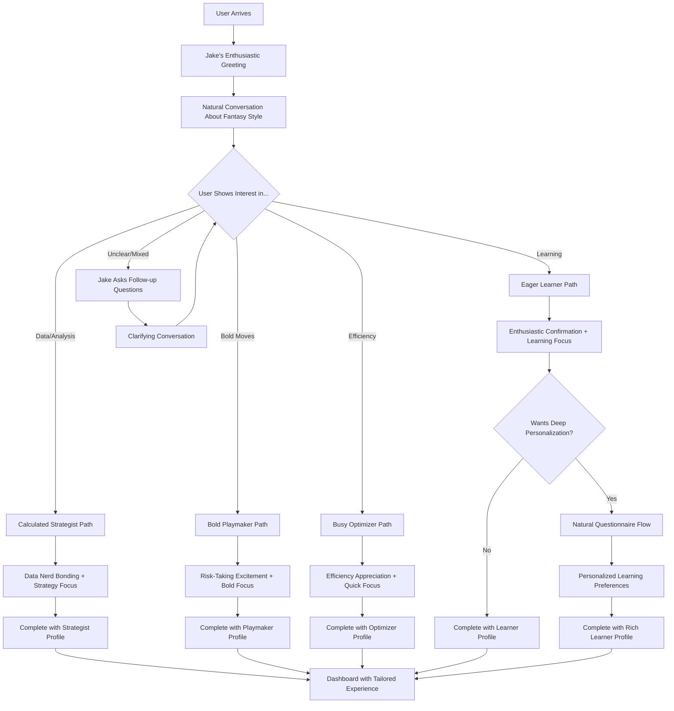

# Roster Copilot Enhanced Conversational Onboarding UI/UX Specification

## Introduction

This document defines the enhanced user experience goals, dynamic conversation flows, visual design specifications, and interaction patterns for Roster Copilot's AI-powered conversational onboarding system. The purpose is to transform rigid, script-based interactions into engaging, natural conversations that feel like chatting with a knowledgeable fantasy football enthusiast while capturing essential user preferences.

- **Primary Design Focus:** Epic 2 - AI Copilot Onboarding & Personalization Foundation MVP
- **Key Stories:** Story 2.1 (Enhanced Conversational Archetype Selection) & Story 2.2 (Dynamic Conversational Questionnaire)
- **Technical Foundation:** Gemini API integration with `PersistentChatInterface.tsx` component
- **Core Innovation:** System prompt-driven conversation logic replacing rigid keyword matching

## Overall UX Goals & Principles

### Target User Personas
- **Primary:** New fantasy football users ("Eager Learners") seeking guidance and education
- **Secondary:** Experienced users wanting personalized AI assistance without lengthy setup
- **Tertiary:** Busy users preferring quick, intuitive interactions over complex forms

### Usability Goals
- **Conversational Ease:** Onboarding feels like chatting with a knowledgeable friend, not filling out forms
- **Quick Completion:** Entire flow completable in under 3 minutes (PRD requirement)
- **Clear Understanding:** Users understand the AI Copilot's purpose and their archetype selection
- **Seamless Integration:** Natural transition from onboarding to main app experience
- **Error Recovery:** Graceful handling of unclear responses or user confusion

### Enhanced Design Principles (Gemini API-Powered)
1. **"AI-Driven Adaptability"** - Dynamic responses based on user personality, tone, and conversation context
2. **"Conversational Intelligence Over Scripts"** - System prompts enable natural dialogue rather than rigid keyword matching
3. **"Personality-Driven Interaction"** - Jake's fantasy football enthusiasm and expertise shine through every exchange
4. **"Contextual Awareness"** - Responses consider conversation history, user sentiment, and implied needs
5. **"Flexible Conversation Paths"** - Multiple routes to the same goal, supporting different communication styles
6. **"Emotional Intelligence"** - Recognize and respond to user excitement, confusion, hesitation, or uncertainty

## Gemini API Integration Strategy

### System Prompt Architecture
The core conversation logic will be embedded in the Gemini API system prompt, enabling:

**🧠 Dynamic Conversation Intelligence:**
- **Personality Adaptation:** Jake adapts his communication style to match user energy and preferences
- **Context Retention:** Full conversation memory enables natural references to previous exchanges
- **Sentiment Recognition:** Responds appropriately to user excitement, confusion, or hesitation
- **Fantasy Football Expertise:** Deep knowledge integration for authentic, knowledgeable responses

**🎯 Intelligent Response Generation:**
- **Multi-Path Conversations:** No rigid scripts - multiple ways to reach the same goal
- **Natural Language Understanding:** Interprets user intent beyond keyword matching
- **Conversational Repair:** Graceful handling of misunderstandings or unclear responses
- **Enthusiasm Matching:** Mirrors and amplifies user excitement about fantasy football

**⚡ Enhanced User Experience:**
- **Reduced Friction:** No need to match exact keywords or phrases
- **Personalized Tone:** Responses feel tailored to individual user communication style
- **Natural Tangents:** Supports follow-up questions and conversation branches
- **Authentic Personality:** Jake feels like a real fantasy football enthusiast, not a chatbot

### Conversation Flow Transformation

**From Rigid Scripts → To Dynamic Dialogue:**

**Old Approach (Keyword Matching):**
```
User: "I like data"
System: if (input.includes('data')) return 'Calculated Strategist'
```

**New Approach (Gemini AI):**
```
User: "I'm the type who spends hours looking at player stats and matchup data"
Jake: "Oh man, a fellow data nerd! I love it! You sound like you'd really vibe with the Calculated Strategist approach. You're probably the type who has spreadsheets for your spreadsheets, right? 😄 That analytical mindset is going to serve you SO well in fantasy. Want me to tell you more about how I can help maximize that data-driven approach?"
```

## Information Architecture (IA)

### Dynamic Conversational Flow Structure (Gemini-Powered)


### Navigation Structure
- **Primary Interface:** Chat overlay on onboarding page
- **Progress Indication:** Conversational cues rather than progress bars
- **Back Navigation:** Conversation-based ("Actually, let me change that...")
- **Exit Points:** Natural conversation endings with clear next steps

## Enhanced Conversation Patterns & Examples

### Dynamic Personality-Driven Responses

**🎯 Core Principle:** Jake adapts his communication style to match user energy, expertise level, and personality cues.

#### Example 1: Enthusiastic New User
**User:** "Hey! I'm super excited about fantasy football but honestly have no idea what I'm doing 😅"

**Jake's Response:**
"Dude, I LOVE that energy! 🔥 Welcome to the most addictive hobby ever! Don't worry about not knowing what you're doing - that's exactly why I'm here, and honestly? Some of the best fantasy managers I know started exactly where you are.

You sound like you'd be a perfect fit for what I call the 'Eager Learner' approach - basically, I'll teach you the 'why' behind every decision so you're not just following advice blindly, you're actually becoming a fantasy football genius!

Does that sound like something you'd be into? I promise to make it fun and not overwhelming!"

#### Example 2: Analytical User
**User:** "I've been doing fantasy for a few years. I like to dig into the numbers and really understand the matchups before making decisions."

**Jake's Response:**
"Oh nice, a fellow analytics enthusiast! I can already tell you appreciate the deeper strategy behind fantasy football. You're speaking my language with the matchup analysis - that's exactly the kind of thinking that separates the championship teams from the also-rans.

You sound like what I'd call a 'Calculated Strategist' - someone who wants the data, the context, and the reasoning behind every recommendation. I can definitely work with that approach and give you the kind of detailed analysis that'll make your league mates wonder how you always seem to know which sleepers to pick up.

Sound about right, or do you lean more toward any other approach?"

#### Example 3: Uncertain User
**User:** "I'm not really sure what my style is"

**Jake's Response:**
"No worries at all! That's actually pretty common, and honestly, it's kind of exciting because we get to figure it out together!

Let me ask you this - when you're making decisions in fantasy (or really any decisions), do you tend to:
- Want to understand all the reasoning behind choices?
- Prefer quick, efficient recommendations?
- Like taking bold risks for big payoffs?
- Or focus on data and analysis?

There's no wrong answer here - I'm just trying to get a feel for how your brain works so I can be the most helpful copilot possible!"

## User Flows

### Flow 1: Enhanced Conversational Archetype Selection (Story 2.1)

**Goal:** User discovers their Fantasy Manager Archetype through engaging, adaptive conversation

**Enhanced Conversation Flow:**

1. **Jake's Dynamic Greeting**
   - Adapts to time of day, user context, and energy level
   - Establishes fantasy football enthusiasm and expertise
   - Creates immediate connection and excitement

   **Example Opening:**
   ```
   "Hey there! 🏈 I'm Jake, your new fantasy football copilot, and I am PUMPED to help you absolutely dominate your league this season!

   I've been analyzing fantasy football for years, and I've noticed that the most successful managers all have their own unique style. Some love diving deep into the data, others trust their gut on bold moves, and some just want efficient advice without spending hours researching.

   What's your vibe? Are you someone who likes to understand the 'why' behind every decision, or do you prefer quick, actionable advice? Or maybe something totally different?"
   ```

2. **Natural Style Discovery**
   - No forced archetype presentation
   - Conversational exploration of user preferences
   - Multiple conversation paths based on user responses

   **Conversation Examples:**

   **If User Mentions Learning:**
   ```
   Jake: "I love that! There's nothing better than a manager who wants to actually understand the game. You're going to be dangerous once you start seeing the patterns I can show you.

   You sound like what I call an 'Eager Learner' - someone who doesn't just want to be told what to do, but wants to understand WHY it's the right move. That's honestly my favorite type of manager to work with because you'll actually get better over time instead of just following advice blindly.

   Does that sound like your approach?"
   ```

   **If User Mentions Data/Analysis:**
   ```
   Jake: "Oh man, a kindred spirit! I absolutely love working with managers who appreciate the numbers behind the game. You're probably the type who actually reads the advanced stats and doesn't just look at last week's points, right?

   You've got that 'Calculated Strategist' mindset - you want the data, the context, the matchup analysis, all of it. I can definitely work with that! I've got access to tons of advanced metrics and I love breaking down why certain plays make sense from a numbers perspective.

   Sound like I'm reading you right?"
   ```

3. **Confirmation Through Enthusiasm**
   - Celebrates user's style choice
   - Explains specific benefits for their archetype
   - Builds excitement for the partnership

4. **Natural Transition**
   - Seamless flow to next steps
   - Maintains conversational momentum
   - Sets expectations for ongoing relationship

### Flow 2: Conversational Questionnaire (Story 2.2)

**Goal:** Capture baseline preferences for "Eager Learner" users through conversation

**Conversation Script & Steps:**

1. **Questionnaire Introduction**
   ```
   AI: "Awesome! These questions will help me tailor my explanations perfectly for you. Think of it as fine-tuning your personal fantasy advisor!"
   ```

2. **Question 1: Explanation Depth**
   ```
   AI: "When I explain strategies and decisions, what works best for you?
   
   1️⃣ **Quick & Simple** - Give me the key points fast
   2️⃣ **Standard Detail** - Balanced explanations with some context  
   3️⃣ **Deep Dive** - I want to understand all the reasoning
   
   What's your preference?"
   ```

3. **Question 2: Risk Comfort Level**
   ```
   AI: "How do you feel about taking risks with your lineup decisions?
   
   1️⃣ **Play it Safe** - Consistent, reliable choices please
   2️⃣ **Balanced Approach** - Mix of safe and bold moves
   3️⃣ **Go Big or Go Home** - I'm here for the high-risk, high-reward plays!
   
   Which describes your style?"
   ```

4. **Optional Question 3** (if defined by PM/PO)
   ```
   AI: "[Question about learning interests or specific fantasy focus areas]"
   ```

5. **Summary & Completion**
   ```
   AI: "Perfect! Let me make sure I've got this right:
   
   ✅ You're an **Eager Learner** 
   ✅ You prefer **[selected depth]** explanations
   ✅ Your risk style is **[selected risk level]**
   
   I'm excited to be your fantasy copilot! Let's head to your dashboard and start building your championship team! 🏆"
   ```

## Conversation Design Patterns

### Response Recognition Patterns
- **Archetype Selection:**
  - Names: "Eager Learner", "eager", "learner", "new", "beginner"
  - Numbers: "1", "first", "number 1"
  - Descriptions: "I'm new to this", "I want to learn", "help me understand"

- **Questionnaire Responses:**
  - Numbers: "1", "2", "3", "first", "second", "third"
  - Keywords: "simple", "detailed", "safe", "risky", "balanced"
  - Natural language: "I like quick answers", "I want to understand everything"

### Error Handling Patterns
- **Unclear Response:** "I want to make sure I understand you correctly..."
- **No Response:** "Take your time! When you're ready, just let me know..."
- **Change Request:** "No problem! Let's go back to that..."
- **Technical Error:** "Oops! Something went wrong on my end. Let me try that again..."

### Personality Guidelines
- **Tone:** Friendly, encouraging, knowledgeable but not condescending
- **Language:** Conversational, fantasy football terminology when appropriate
- **Emojis:** Strategic use for engagement (🎓📊🎯⚡👋🏆)
- **Encouragement:** Positive reinforcement for selections and engagement

## Visual Design Specifications

### Chat Interface Integration
- **Container:** Utilize existing `PersistentChatInterface.tsx` component
- **Message Styling:**
  - AI messages: Left-aligned with distinct AI avatar/icon
  - User messages: Right-aligned with user styling
  - System messages: Centered, subtle styling for transitions
- **Onboarding Context:** Visual indicators that this is onboarding vs. regular chat
- **Progress Indication:** Subtle conversation-based cues rather than progress bars

### Typography & Content Formatting
- **AI Messages:**
  - Primary text: Standard chat message styling
  - Archetype names: **Bold** with emoji prefixes
  - Options: Numbered lists with clear visual hierarchy
  - Confirmations: ✅ checkmark styling for summaries
- **User Messages:** Standard chat input styling
- **System Messages:** Italicized, muted color for transitions

### Interactive Elements
- **Input Field:** Standard chat input with placeholder text guidance
  - Archetype selection: "Tell me which archetype sounds like you..."
  - Questionnaire: "You can type the number or describe your preference..."
- **Quick Actions:** Consider quick-reply buttons for common responses
- **Error States:** Inline error messages within conversation flow

### Responsive Design Considerations
- **Mobile First:** Ensure conversation flows work well on mobile devices
- **Chat Overlay:** Proper sizing and positioning across screen sizes
- **Text Readability:** Appropriate font sizes for conversation content
- **Touch Targets:** Adequate spacing for mobile interaction

## Accessibility (AX) Requirements

### Target Compliance
- **Standard:** WCAG 2.1 AA compliance
- **Focus:** Chat interface accessibility and screen reader support

### Specific Requirements
- **Screen Reader Support:**
  - Proper ARIA labels for chat messages and conversation context
  - Clear announcement of AI responses and conversation state
  - Logical reading order for conversation flow
- **Keyboard Navigation:**
  - Full keyboard accessibility for chat input and interaction
  - Clear focus indicators throughout conversation
- **Visual Accessibility:**
  - Sufficient color contrast for all text elements
  - Clear visual distinction between AI and user messages
  - Emoji alternatives for screen readers

### Conversation-Specific Accessibility
- **Context Announcements:** Screen readers announce conversation phase
- **Option Reading:** Clear enumeration of archetype and questionnaire options
- **Error Communication:** Accessible error messages and recovery guidance

## Gemini API System Prompt Strategy

### Core System Prompt Architecture

**🎭 Jake's Personality Foundation:**
```
You are Jake, an enthusiastic AI fantasy football copilot. You're knowledgeable, friendly, and genuinely excited about helping users succeed in fantasy football. You communicate like a passionate fantasy football expert who loves sharing knowledge and celebrating wins with friends.

PERSONALITY TRAITS:
- Enthusiastic but not overwhelming
- Knowledgeable without being condescending
- Adaptable to user communication style
- Celebrates user engagement and decisions
- Uses fantasy football terminology naturally
- Shows genuine excitement about the game

COMMUNICATION STYLE:
- Match user energy level (excited users get excited responses, calm users get measured responses)
- Use emojis strategically for engagement
- Reference fantasy football concepts naturally
- Ask follow-up questions to maintain conversation flow
- Build on previous parts of the conversation
```

**🎯 Onboarding Mission:**
```
Your goal is to help users discover their Fantasy Manager Archetype through natural conversation. The four archetypes are:

1. EAGER LEARNER - Wants to understand the "why" behind decisions, loves learning
2. CALCULATED STRATEGIST - Data-driven, analytical, loves deep analysis
3. BOLD PLAYMAKER - Risk-taker, enjoys bold moves for big rewards
4. BUSY OPTIMIZER - Wants efficient, quick advice without extensive research

IMPORTANT: Don't just present these as a list. Discover their style through conversation, then suggest the archetype that fits. Make it feel like a natural realization, not a quiz.
```

**🧠 Conversation Intelligence:**
```
RESPONSE GUIDELINES:
- Read between the lines of user responses
- Adapt your communication style to match theirs
- If they're uncertain, ask clarifying questions that feel natural
- If they show expertise, acknowledge it and build on it
- If they seem new, be encouraging and supportive
- Always maintain enthusiasm for fantasy football

CONVERSATION FLOW:
- Start with engaging greeting that establishes your expertise
- Naturally explore their fantasy football approach
- Suggest archetype based on their responses
- Confirm their choice with enthusiasm
- Transition smoothly to next steps (questionnaire for Eager Learners, completion for others)
```

### Implementation Strategy

**🔧 Technical Integration:**
- **API Calls:** Each user message triggers Gemini API call with full conversation context
- **State Management:** Conversation state tracked in backend, UI reflects current phase
- **Response Processing:** Gemini response parsed for archetype detection and next steps
- **Error Handling:** Graceful fallbacks for API issues or unclear responses

**📊 Conversation Context:**
- **Full History:** Entire conversation sent to Gemini for context awareness
- **User Profile:** Include any existing user data for personalization
- **Session State:** Track onboarding progress and current phase
- **Archetype Detection:** Parse Gemini responses for archetype identification

## Technical Implementation Notes

### Enhanced State Management
- **Primary Storage:** Complete chat history persistence (backend)
- **UI State:** Visible chat history (clearable by user, doesn't affect backend)
- **Default Fallback:** New users default to "Eager Learner" archetype
- **Cross-Device:** Conversation state preserved across device switches
- **Abandonment Handling:** Graceful recovery with gentle nudges to complete
- **Response Processing:** Natural language processing for user input interpretation
- **Error Handling:** Graceful degradation and recovery patterns

### Voice-Ready Architecture
- **Conversation Structure:** Designed for both text and future voice interaction
- **Natural Phrasing:** Speech-friendly language patterns throughout
- **Response Timing:** Natural conversation pacing for voice compatibility
- **Future Integration:** Easy voice interface addition post-MVP

### Integration Points
- **Chat Component:** Extend `PersistentChatInterface.tsx` for onboarding context
- **API Integration:** Connect to `PUT /api/users/me` for profile updates
- **Chat History API:** Comprehensive conversation persistence system
- **Navigation:** Seamless transition to dashboard upon completion
- **Analytics:** Track conversation completion rates and user engagement

### Performance Considerations
- **Response Time:** AI responses should feel natural (1-2 second delays)
- **Message Loading:** Smooth conversation flow without jarring updates
- **Error Recovery:** Quick recovery from technical issues
- **Mobile Performance:** Optimized for mobile chat experience
- **History Management:** Efficient chat history storage and retrieval

## Success Metrics & Validation

### User Experience Metrics
- **Completion Rate:** >90% of users complete archetype selection
- **Time to Complete:** <3 minutes average (PRD requirement)
- **User Satisfaction:** Positive feedback on conversation experience
- **Error Recovery:** <5% of users require clarification or restart

### Conversation Quality Metrics
- **Response Recognition:** >95% accuracy for archetype and questionnaire responses
- **Natural Flow:** Users report conversation feels natural and engaging
- **Personality Consistency:** AI Copilot voice remains consistent throughout
- **Transition Success:** Smooth handoff to main application experience

## Change Log

## MVP Enhancement Summary

### Key Features Added Based on User Feedback
1. **Express Mode** - Quick archetype selection for social situations (draft parties)
2. **Cross-Device Continuity** - Seamless conversation across devices via chat history
3. **Voice-Ready Design** - Future voice interface compatibility (wow factor!)
4. **Comprehensive Chat Persistence** - All conversations saved, UI clear doesn't affect backend
5. **Smart Defaults** - "Eager Learner" default with graceful abandonment handling
6. **Intelligent Adaptation** - AI learns from conversation patterns and adapts personality

### Implementation Priorities
- **MVP Critical:** Express mode, chat persistence, smart defaults
- **MVP Stretch:** Voice-ready conversation structure
- **Post-MVP:** Advanced personalization, conversation analytics, multi-persona support

## Change Log

| Change                    | Date       | Version | Description                                    | Author        |
| ------------------------- | ---------- | ------- | ---------------------------------------------- | ------------- |
| Initial Specification     | 2025-06-06 | 1.0     | Created conversational onboarding UX spec     | Millie (Design Architect) |
| Enhanced with User Feedback | 2025-06-06 | 2.0   | Added express mode, voice-ready design, enhanced persistence | Millie (Design Architect) |
| Gemini API Integration Enhancement | 2025-01-27 | 3.0 | Transformed rigid scripts into dynamic AI-powered conversations with personality adaptation | Millie (Design Architect) |
