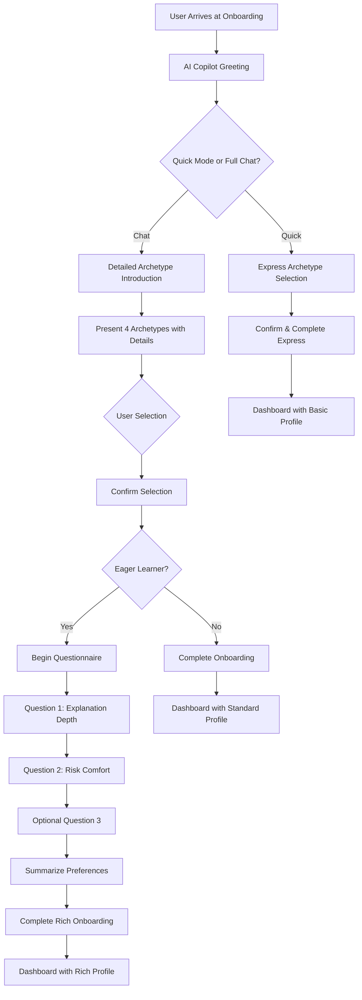

# Roster Copilot Conversational Onboarding UI/UX Specification

## Introduction

This document defines the user experience goals, conversation flows, visual design specifications, and interaction patterns for Roster Copilot's conversational onboarding system. The purpose is to transform the traditional form-based onboarding into an engaging, natural conversation that establishes the AI Copilot's personality while capturing essential user preferences.

- **Primary Design Focus:** Epic 2 - AI Copilot Onboarding & Personalization Foundation MVP
- **Key Stories:** Story 2.1 (Conversational Archetype Selection) & Story 2.2 (Conversational Questionnaire)
- **Technical Foundation:** Existing `PersistentChatInterface.tsx` component

## Overall UX Goals & Principles

### Target User Personas
- **Primary:** New fantasy football users ("Eager Learners") seeking guidance and education
- **Secondary:** Experienced users wanting personalized AI assistance without lengthy setup
- **Tertiary:** Busy users preferring quick, intuitive interactions over complex forms

### Usability Goals
- **Conversational Ease:** Onboarding feels like chatting with a knowledgeable friend, not filling out forms
- **Quick Completion:** Entire flow completable in under 3 minutes (PRD requirement)
- **Clear Understanding:** Users understand the AI Copilot's purpose and their archetype selection
- **Seamless Integration:** Natural transition from onboarding to main app experience
- **Error Recovery:** Graceful handling of unclear responses or user confusion

### Design Principles
1. **"Conversation Over Forms"** - Natural dialogue patterns replace traditional UI elements
2. **"Progressive Personality Reveal"** - AI Copilot's character emerges through conversation tone
3. **"Clarity Through Context"** - Information provided when needed, not all at once
4. **"Forgiving Interaction"** - Multiple ways to respond, easy error recovery
5. **"Consistent Voice"** - Maintain AI Copilot personality throughout conversation

## Information Architecture (IA)

### Enhanced Conversational Flow Structure


### Navigation Structure
- **Primary Interface:** Chat overlay on onboarding page
- **Progress Indication:** Conversational cues rather than progress bars
- **Back Navigation:** Conversation-based ("Actually, let me change that...")
- **Exit Points:** Natural conversation endings with clear next steps

## User Flows

### Flow 1: Conversational Archetype Selection (Story 2.1)

**Goal:** User selects their Fantasy Manager Archetype through natural conversation

**Conversation Script & Steps:**

1. **AI Greeting & Mode Selection**
   ```
   AI: "Hi there! 👋 I'm your AI Copilot, and I'm excited to help you dominate your fantasy league!

   To give you the best personalized advice, I'd love to understand your fantasy football style.

   Want the quick version, or should we chat a bit?
   ⚡ **Quick Setup** - Fast archetype selection (perfect if friends are watching!)
   💬 **Let's Chat** - I'll explain each style so you can pick the perfect fit"
   ```

2. **Archetype Presentation**
   ```
   AI: "I've identified four main Fantasy Manager Archetypes. Let me tell you about each:

   🎓 **Eager Learner** - Perfect if you're new to fantasy or love learning the 'why' behind decisions
   📊 **Calculated Strategist** - For data-driven managers who love deep analysis  
   🎯 **Bold Playmaker** - Risk-takers who go for high-reward moves
   ⚡ **Busy Optimizer** - Efficient managers who want quick, smart decisions

   Which one sounds most like you? You can tell me the name, number, or just describe your style!"
   ```

3. **User Response Handling**
   - **Clear Selection:** "Great choice! Eager Learner it is!"
   - **Unclear Response:** "I want to make sure I understand - are you thinking more [archetype A] or [archetype B]?"
   - **Request for More Info:** Provide detailed explanation of specific archetype

4. **Confirmation & Transition**
   ```
   AI: "Perfect! As an [Selected Archetype], I'll [specific benefit]. 
   
   [If Eager Learner]: Since you're eager to learn, I'd love to ask a few quick questions to personalize my advice even more. Ready?"
   
   [If Other]: You're all set! Let's get you to your dashboard where the magic happens!"
   ```

### Flow 2: Conversational Questionnaire (Story 2.2)

**Goal:** Capture baseline preferences for "Eager Learner" users through conversation

**Conversation Script & Steps:**

1. **Questionnaire Introduction**
   ```
   AI: "Awesome! These questions will help me tailor my explanations perfectly for you. Think of it as fine-tuning your personal fantasy advisor!"
   ```

2. **Question 1: Explanation Depth**
   ```
   AI: "When I explain strategies and decisions, what works best for you?
   
   1️⃣ **Quick & Simple** - Give me the key points fast
   2️⃣ **Standard Detail** - Balanced explanations with some context  
   3️⃣ **Deep Dive** - I want to understand all the reasoning
   
   What's your preference?"
   ```

3. **Question 2: Risk Comfort Level**
   ```
   AI: "How do you feel about taking risks with your lineup decisions?
   
   1️⃣ **Play it Safe** - Consistent, reliable choices please
   2️⃣ **Balanced Approach** - Mix of safe and bold moves
   3️⃣ **Go Big or Go Home** - I'm here for the high-risk, high-reward plays!
   
   Which describes your style?"
   ```

4. **Optional Question 3** (if defined by PM/PO)
   ```
   AI: "[Question about learning interests or specific fantasy focus areas]"
   ```

5. **Summary & Completion**
   ```
   AI: "Perfect! Let me make sure I've got this right:
   
   ✅ You're an **Eager Learner** 
   ✅ You prefer **[selected depth]** explanations
   ✅ Your risk style is **[selected risk level]**
   
   I'm excited to be your fantasy copilot! Let's head to your dashboard and start building your championship team! 🏆"
   ```

## Conversation Design Patterns

### Response Recognition Patterns
- **Archetype Selection:**
  - Names: "Eager Learner", "eager", "learner", "new", "beginner"
  - Numbers: "1", "first", "number 1"
  - Descriptions: "I'm new to this", "I want to learn", "help me understand"

- **Questionnaire Responses:**
  - Numbers: "1", "2", "3", "first", "second", "third"
  - Keywords: "simple", "detailed", "safe", "risky", "balanced"
  - Natural language: "I like quick answers", "I want to understand everything"

### Error Handling Patterns
- **Unclear Response:** "I want to make sure I understand you correctly..."
- **No Response:** "Take your time! When you're ready, just let me know..."
- **Change Request:** "No problem! Let's go back to that..."
- **Technical Error:** "Oops! Something went wrong on my end. Let me try that again..."

### Personality Guidelines
- **Tone:** Friendly, encouraging, knowledgeable but not condescending
- **Language:** Conversational, fantasy football terminology when appropriate
- **Emojis:** Strategic use for engagement (🎓📊🎯⚡👋🏆)
- **Encouragement:** Positive reinforcement for selections and engagement

## Visual Design Specifications

### Chat Interface Integration
- **Container:** Utilize existing `PersistentChatInterface.tsx` component
- **Message Styling:**
  - AI messages: Left-aligned with distinct AI avatar/icon
  - User messages: Right-aligned with user styling
  - System messages: Centered, subtle styling for transitions
- **Onboarding Context:** Visual indicators that this is onboarding vs. regular chat
- **Progress Indication:** Subtle conversation-based cues rather than progress bars

### Typography & Content Formatting
- **AI Messages:**
  - Primary text: Standard chat message styling
  - Archetype names: **Bold** with emoji prefixes
  - Options: Numbered lists with clear visual hierarchy
  - Confirmations: ✅ checkmark styling for summaries
- **User Messages:** Standard chat input styling
- **System Messages:** Italicized, muted color for transitions

### Interactive Elements
- **Input Field:** Standard chat input with placeholder text guidance
  - Archetype selection: "Tell me which archetype sounds like you..."
  - Questionnaire: "You can type the number or describe your preference..."
- **Quick Actions:** Consider quick-reply buttons for common responses
- **Error States:** Inline error messages within conversation flow

### Responsive Design Considerations
- **Mobile First:** Ensure conversation flows work well on mobile devices
- **Chat Overlay:** Proper sizing and positioning across screen sizes
- **Text Readability:** Appropriate font sizes for conversation content
- **Touch Targets:** Adequate spacing for mobile interaction

## Accessibility (AX) Requirements

### Target Compliance
- **Standard:** WCAG 2.1 AA compliance
- **Focus:** Chat interface accessibility and screen reader support

### Specific Requirements
- **Screen Reader Support:**
  - Proper ARIA labels for chat messages and conversation context
  - Clear announcement of AI responses and conversation state
  - Logical reading order for conversation flow
- **Keyboard Navigation:**
  - Full keyboard accessibility for chat input and interaction
  - Clear focus indicators throughout conversation
- **Visual Accessibility:**
  - Sufficient color contrast for all text elements
  - Clear visual distinction between AI and user messages
  - Emoji alternatives for screen readers

### Conversation-Specific Accessibility
- **Context Announcements:** Screen readers announce conversation phase
- **Option Reading:** Clear enumeration of archetype and questionnaire options
- **Error Communication:** Accessible error messages and recovery guidance

## Technical Implementation Notes

### Enhanced State Management
- **Primary Storage:** Complete chat history persistence (backend)
- **UI State:** Visible chat history (clearable by user, doesn't affect backend)
- **Default Fallback:** New users default to "Eager Learner" archetype
- **Cross-Device:** Conversation state preserved across device switches
- **Abandonment Handling:** Graceful recovery with gentle nudges to complete
- **Response Processing:** Natural language processing for user input interpretation
- **Error Handling:** Graceful degradation and recovery patterns

### Voice-Ready Architecture
- **Conversation Structure:** Designed for both text and future voice interaction
- **Natural Phrasing:** Speech-friendly language patterns throughout
- **Response Timing:** Natural conversation pacing for voice compatibility
- **Future Integration:** Easy voice interface addition post-MVP

### Integration Points
- **Chat Component:** Extend `PersistentChatInterface.tsx` for onboarding context
- **API Integration:** Connect to `PUT /api/users/me` for profile updates
- **Chat History API:** Comprehensive conversation persistence system
- **Navigation:** Seamless transition to dashboard upon completion
- **Analytics:** Track conversation completion rates and user engagement

### Performance Considerations
- **Response Time:** AI responses should feel natural (1-2 second delays)
- **Message Loading:** Smooth conversation flow without jarring updates
- **Error Recovery:** Quick recovery from technical issues
- **Mobile Performance:** Optimized for mobile chat experience
- **History Management:** Efficient chat history storage and retrieval

## Success Metrics & Validation

### User Experience Metrics
- **Completion Rate:** >90% of users complete archetype selection
- **Time to Complete:** <3 minutes average (PRD requirement)
- **User Satisfaction:** Positive feedback on conversation experience
- **Error Recovery:** <5% of users require clarification or restart

### Conversation Quality Metrics
- **Response Recognition:** >95% accuracy for archetype and questionnaire responses
- **Natural Flow:** Users report conversation feels natural and engaging
- **Personality Consistency:** AI Copilot voice remains consistent throughout
- **Transition Success:** Smooth handoff to main application experience

## Change Log

## MVP Enhancement Summary

### Key Features Added Based on User Feedback
1. **Express Mode** - Quick archetype selection for social situations (draft parties)
2. **Cross-Device Continuity** - Seamless conversation across devices via chat history
3. **Voice-Ready Design** - Future voice interface compatibility (wow factor!)
4. **Comprehensive Chat Persistence** - All conversations saved, UI clear doesn't affect backend
5. **Smart Defaults** - "Eager Learner" default with graceful abandonment handling
6. **Intelligent Adaptation** - AI learns from conversation patterns and adapts personality

### Implementation Priorities
- **MVP Critical:** Express mode, chat persistence, smart defaults
- **MVP Stretch:** Voice-ready conversation structure
- **Post-MVP:** Advanced personalization, conversation analytics, multi-persona support

## Change Log

| Change                    | Date       | Version | Description                                    | Author        |
| ------------------------- | ---------- | ------- | ---------------------------------------------- | ------------- |
| Initial Specification     | 2025-06-06 | 1.0     | Created conversational onboarding UX spec     | Millie (Design Architect) |
| Enhanced with User Feedback | 2025-06-06 | 2.0   | Added express mode, voice-ready design, enhanced persistence | Millie (Design Architect) |
