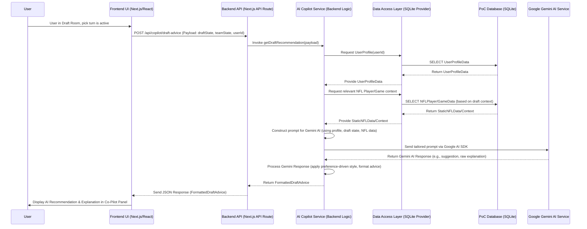

## Core Workflow / Sequence Diagrams

**1. User Requesting and Receiving Draft Advice via "Draft Day Co-Pilot"**


**2. User Accessing and Acting on an Insight from the "Weekly Strategy Digest"**
```mermaid
sequenceDiagram
    participant U as User
    participant FE as Frontend UI (Next.js/React)
    participant API as Backend API (Next.js API Route)
    participant AIMS as AI Copilot Service (Backend Logic)
    participant DAL as Data Access Layer (SQLite Provider)
    participant DB as PoC Database (SQLite)
    participant GAI as Google Gemini AI Service

    %% --- Part 1: User Accessing the Weekly Strategy Digest ---
    U->>FE: Navigates to view Weekly Digest (e.g., from Dashboard link, AI Panel, or direct navigation)
    FE->>API: GET /api/copilot/weekly-digest (Payload: userId, currentWeek_PoC)
    API->>AIMS: Invoke getWeeklyStrategyDigest(userId, currentWeek_PoC)
    
    AIMS->>DAL: Request UserProfile(userId)
    DAL->>DB: SELECT UserProfileData
    DB-->>DAL: Return UserProfileData
    DAL-->>AIMS: Provide UserProfileData
    
    AIMS->>DAL: Request Static NFL Data for relevant week
    DAL->>DB: SELECT NFLPlayer/GameData for currentWeek_PoC
    DB-->>DAL: Return StaticNFLData
    DAL-->>AIMS: Provide StaticNFLData
    
    AIMS->>AIMS: Construct prompt for Gemini AI (for digest content)
    AIMS->>GAI: Send tailored prompt for Weekly Digest content
    GAI-->>AIMS: Return Gemini AI Response (digest content elements)
    
    AIMS->>AIMS: Process Gemini Response (format into digest, apply preference-driven style)
    AIMS-->>API: Return FormattedWeeklyDigest
    API-->>FE: Send JSON Response (FormattedWeeklyDigest)
    FE->>U: Display Weekly Strategy Digest screen

    %% --- Part 2: User Acting on an Insight from the Digest (Example: Making a Waiver Claim) ---
    U->>FE: Clicks "Claim Player X" button in Digest
    FE->>API: POST /api/league/[leagueId]/my-team/roster/add (Payload: userId, playerId_to_claim, teamId) 
            
    API->>AIMS: (Optional for PoC) Notify AI Copilot Service of user action
    API-->>FE: Send JSON Response (e.g., { success: true, message: "Waiver claim for Player X submitted!" })
    FE->>U: Display confirmation message